# AlarmKitDemo

AlarmKit, SwiftUI, ActivityKit을 활용해 구현한 iOS 알람 앱입니다.  
알람 등록/수정/삭제, 반복 일정, 스누즈, 사운드 및 볼륨 설정, Live Activity, 알람 종료 후 로그 기록 흐름을 포함합니다.

<br>

## 스크린샷

#### 메인 화면

| <small>Alarms</small> | <small>Remove</small> |
| --- | --- |
| 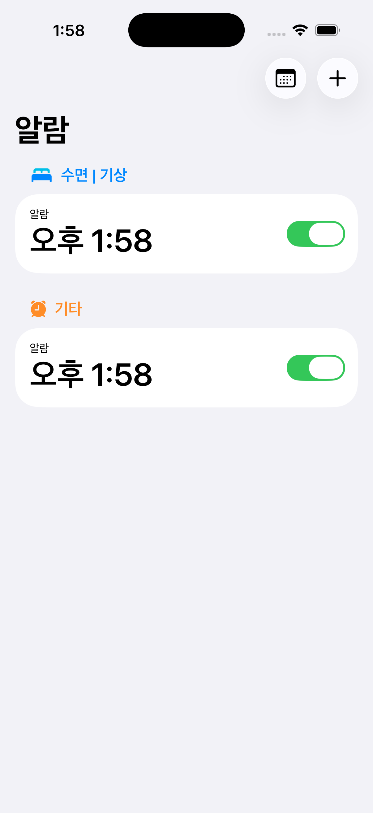 | 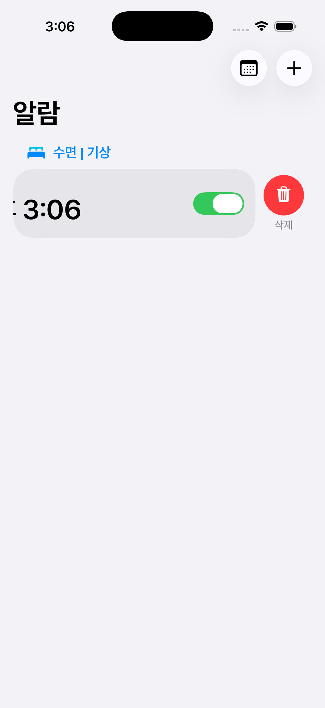 |

#### 알람 등록 화면

| <small>Register</small> | <small>Title</small> |
| --- | --- |
| 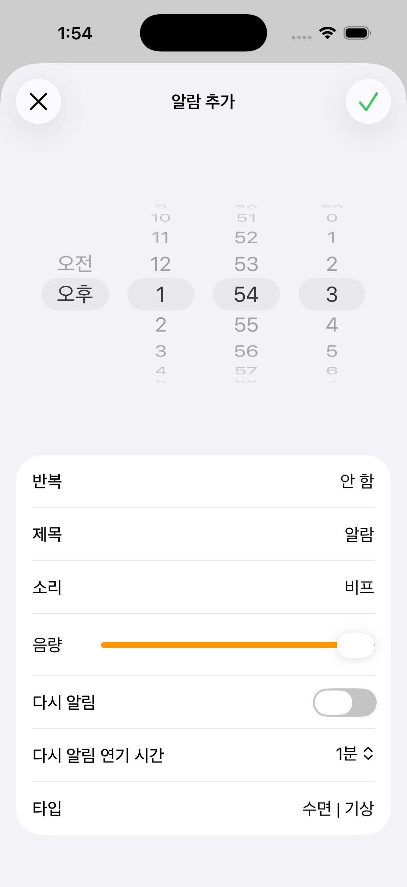 | 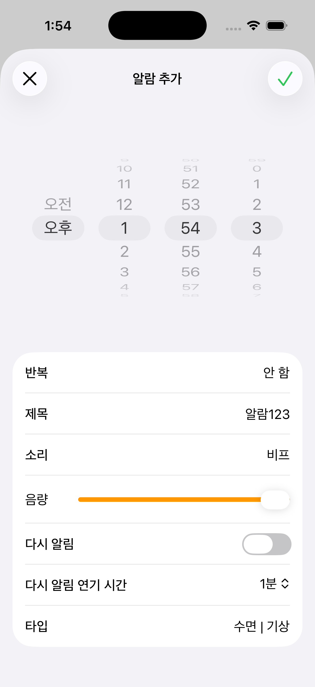 |

| <small>Repeat Option</small> | <small>Sound</small> |
| --- | --- |
| 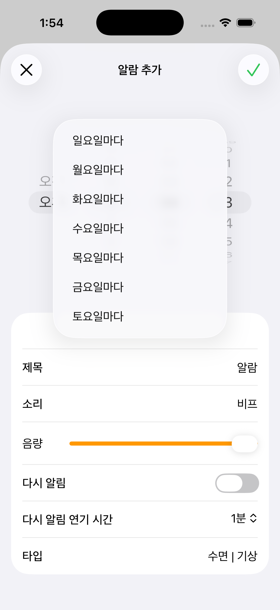 | 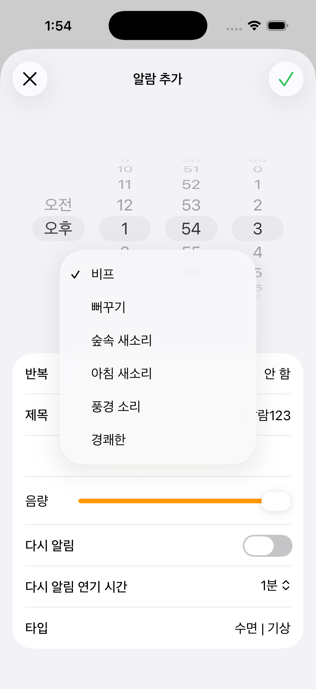 |

| <small>Sound Volume</small> | <small>Snooze</small> |
| --- | --- |
| 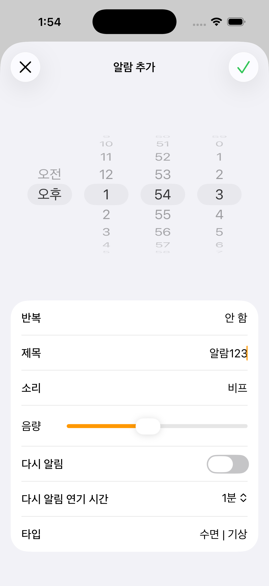 | 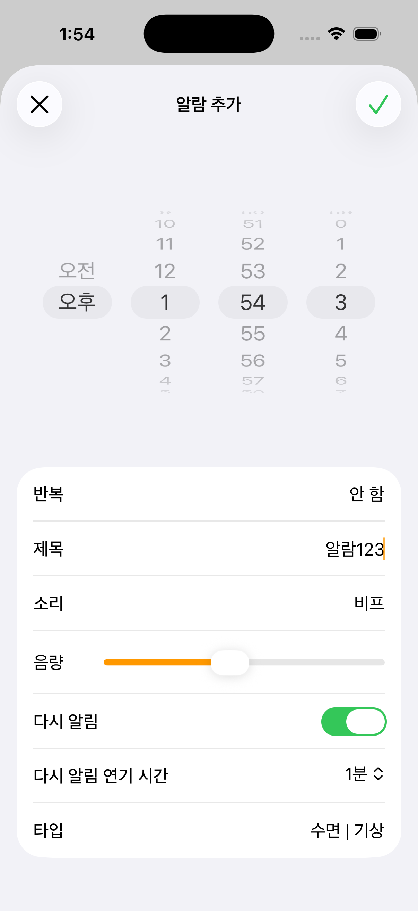 |

| <small>Snooze Duration</small> | <small>Type</small> |
| --- | --- |
| 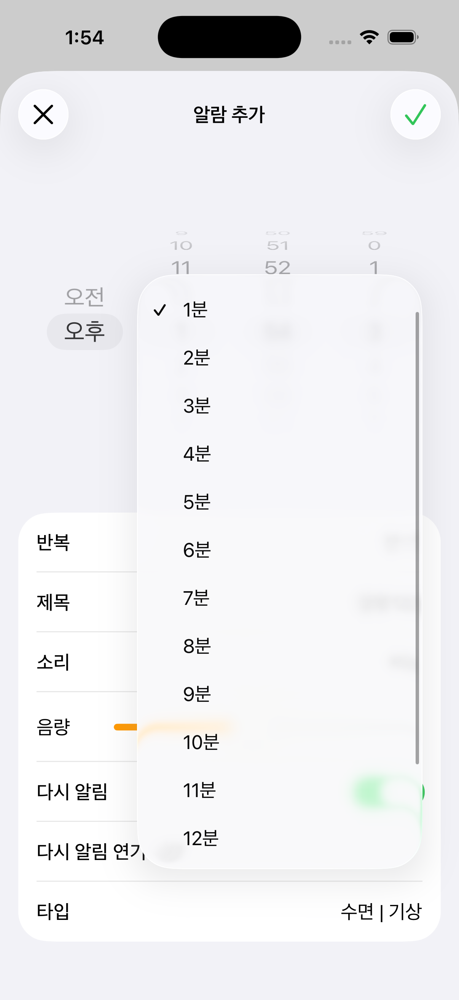 | 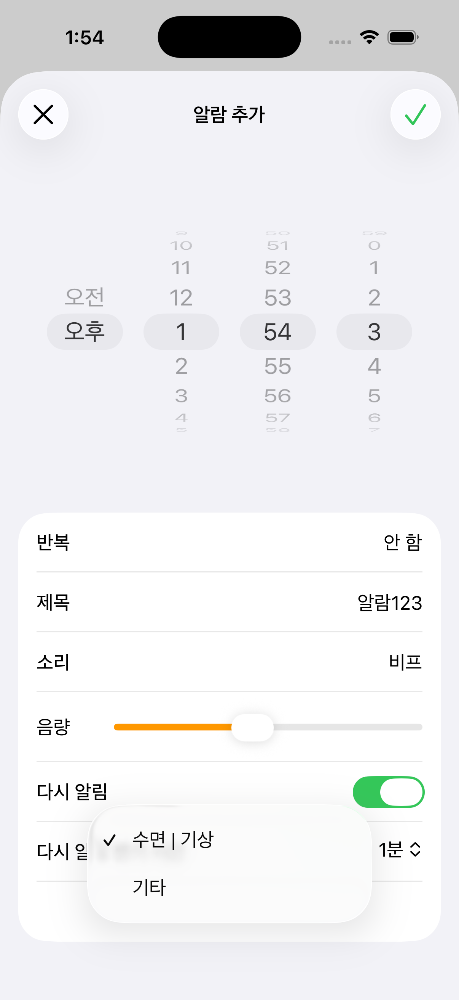 |

#### 알람 동작 상태별

| <small>Foreground</small> | <small>Background</small> | <small>Lock Screen</small> |
| --- | --- | --- |
| 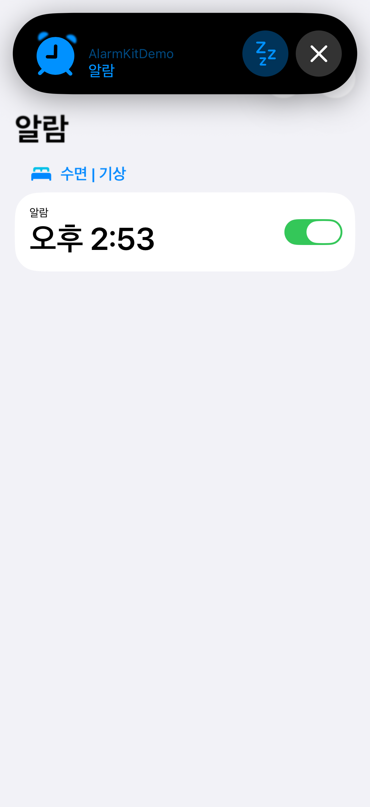 | 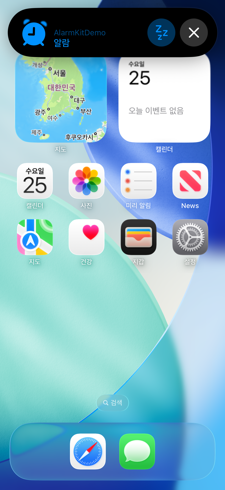 | 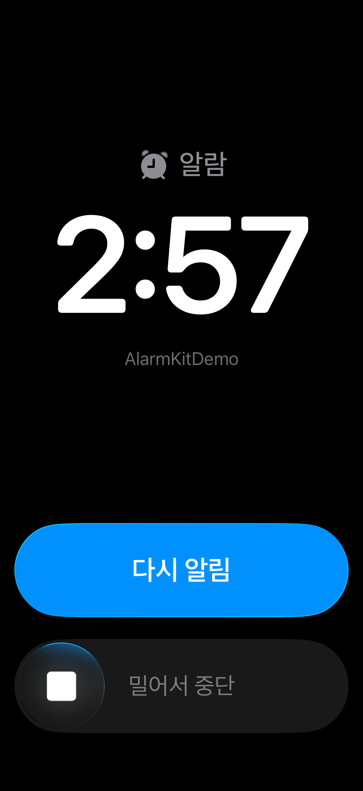 |

#### 로그 화면

| <small>Log Alert</small> | <small>Log Calendar</small> |
| --- | --- |
| 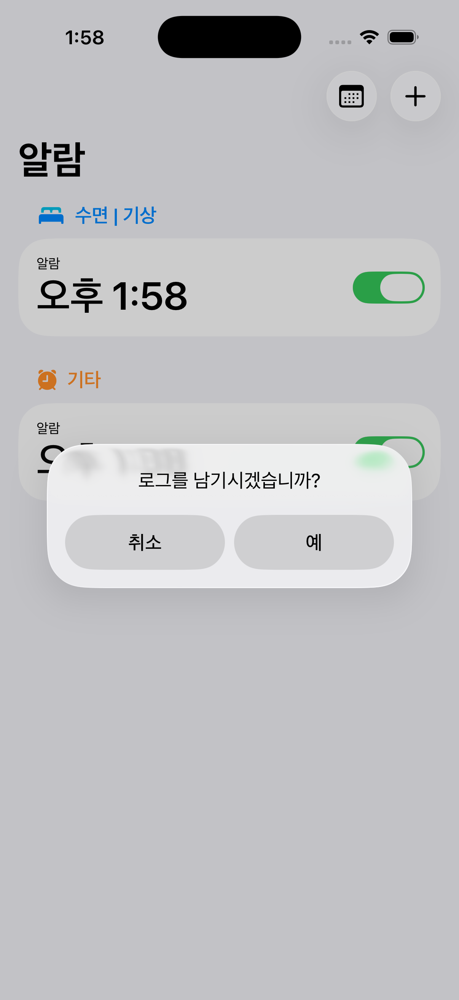 | 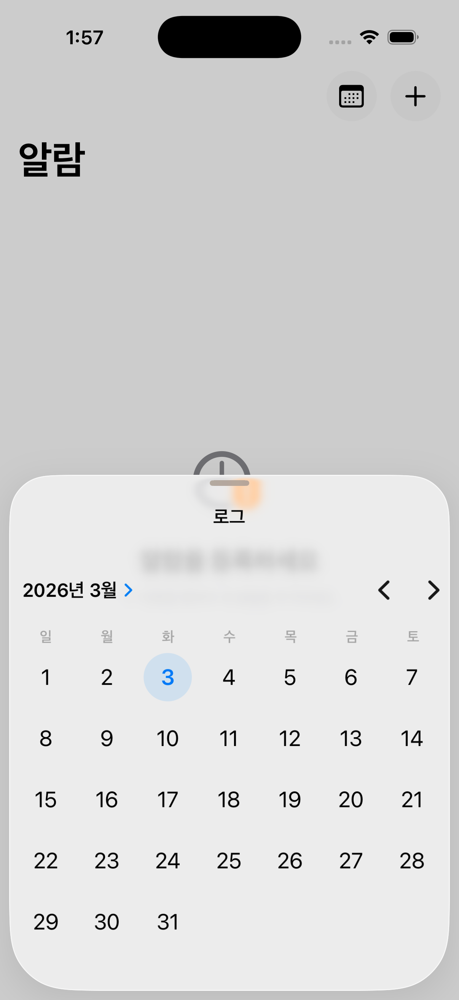 |

#### UI/접근성 테스트

| <small>Color Scheme</small> | <small>Dynamic Type</small> | <small>Orientation</small> |
| --- | --- | --- |
| 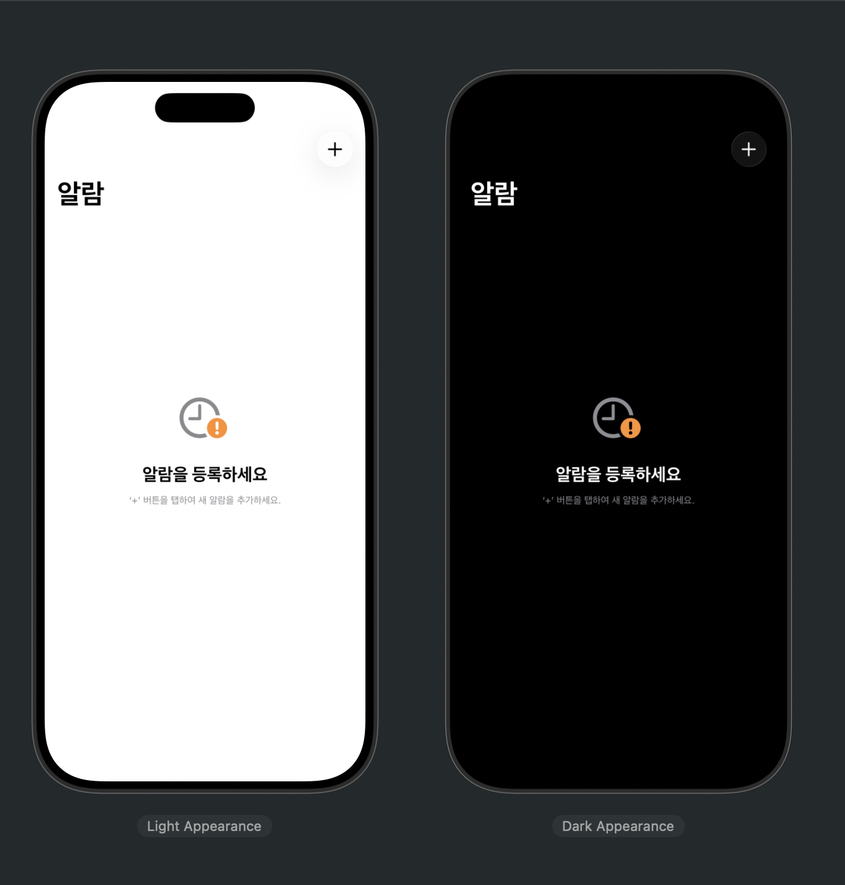 | 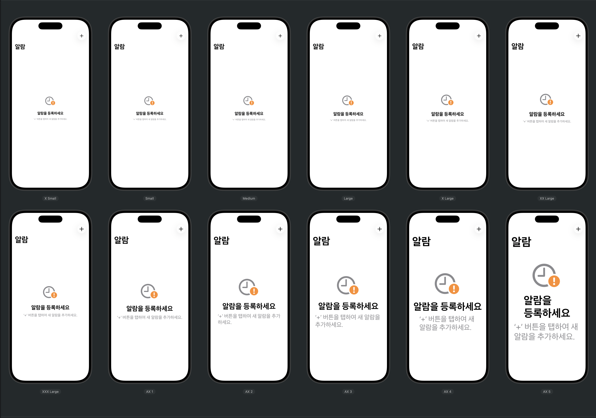 | 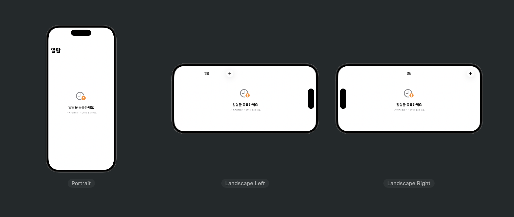 |

<br>

## 주요 기능

- 알람 등록/수정/삭제
- 알람 타입 분리 (`Sleep | Wake Up`, `Other`)
- 요일 반복 옵션 (`AlarmRepeatOptions`)
- 사운드 선택 (`Beep`, `Cuckoo Bird`, `Forest Birds`, `Morning Birds`, `Wind Chime`, `Cheerful`)
- 볼륨 설정
- 스누즈 on/off + 스누즈 시간 설정
- Live Activity 버튼 액션 추적 (`Stop`, `Snooze`)
- 알람 종료 후 Log Alert(확인/취소) + 날짜 로그 기록
- 로그 영구 저장: `SwiftData` (`LogEntity`)

<br>

## 기술 스택

- Swift, SwiftUI
- AlarmKit
- AppIntents / ActivityKit
- SwiftData (로그 저장)
- UserDefaults (알람 섹션 저장)

<br>

## 실행 방법

1. `AlarmKitDemo.xcodeproj`를 Xcode에서 엽니다.
2. Scheme `AlarmKitDemo` 선택 후 빌드/실행합니다.
3. 최초 실행 시 알람 권한을 허용합니다.
4. `+` 버튼으로 알람을 등록해 동작을 확인합니다.

<br>

## 프로젝트 구조

```text
AlarmKitDemo/
├─ README.md
├─ Documents/
├─ AlarmKitDemo/
│  ├─ Alarm/
│  ├─ Register/
│  ├─ LiveActivity/
│  ├─ Log/
│  └─ Resources/
│     └─ Sounds/
├─ AlarmKitDemo.xcodeproj
```

<br>

## 동작 흐름

1. `AlarmRegisterData.schedule()`에서 `AlarmManager`로 알람을 스케줄링합니다.
2. `AlarmsData.updateAlarms()`가 `alarmUpdates` 스트림을 구독해 상태를 동기화합니다.
3. 알람이 울린 뒤 `Stop(X)`으로 종료되면 Log Alert를 띄웁니다.
4. Log Alert:
   - `OK`: 로그 저장 후(반복 없음이면) 알람 제거
   - `Cancel`: 알람 제거
5. 로그 저장/조회는 `SwiftData`의 `LogEntity`를 사용합니다.

<br>

## 데이터 저장

- 알람 목록: `UserDefaults` (`AlarmSections` 키)
- 로그: `SwiftData` (`LogEntity`)

<br>

## 참고 사항

- 현재 프로젝트 설정 배포 타깃: `iOS 26.0` (`project.pbxproj` 기준)
- AlarmKit/Live Activity 특성상 실제 기기 테스트를 권장합니다.
- 로컬라이징 리소스: `en`, `ko`
